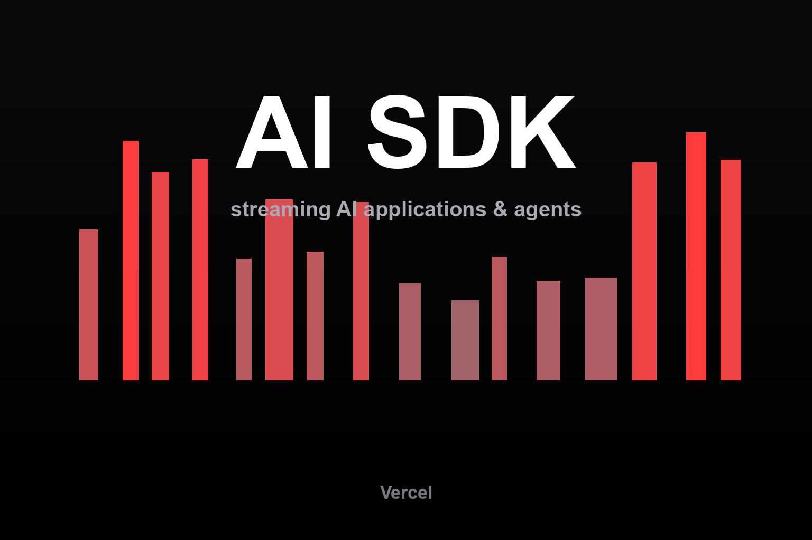

# Vercel AI SDK



Reference skill for the [Vercel AI SDK](https://ai-sdk.dev/) — the
provider-agnostic TypeScript toolkit for building streaming AI applications and
agents. It steers an agent toward current APIs (`generateText`, `streamText`,
`generateObject`, `useChat`, `ToolLoopAgent`) and away from renamed or legacy
surfaces, without relying on stale version recall.

## Install

```bash
npx skills add hardgraph/skills --skill ai-sdk
```

## Use this skill for

- Generating or streaming text and structured output from any provider
- Tool calling and multi-step agent loops (`maxSteps`, `ToolLoopAgent`)
- Wiring `useChat` chat UIs to a streaming route handler
- Choosing and switching model providers (OpenAI, Anthropic, Google, …)
- Resolving current SDK and model versions instead of guessing

## What is included

- [`SKILL.md`](./SKILL.md) — the agent procedure and integration guardrails.
- [`references/vendor/llms.txt/`](./references/vendor/llms.txt/) — a reproducible
  verbatim mirror of the AI SDK documentation the seed index links to, used for
  exact API and behaviour details.

The skill directs agents to verify anything that drifts (versions, hook shapes,
tool-state enums) against the mirrored docs rather than asserting a remembered
value.

## Source

Reference material is reproduced from the
[AI SDK documentation](https://ai-sdk.dev/) via its official
[llms.txt index](https://ai-sdk.dev/llms.txt).
