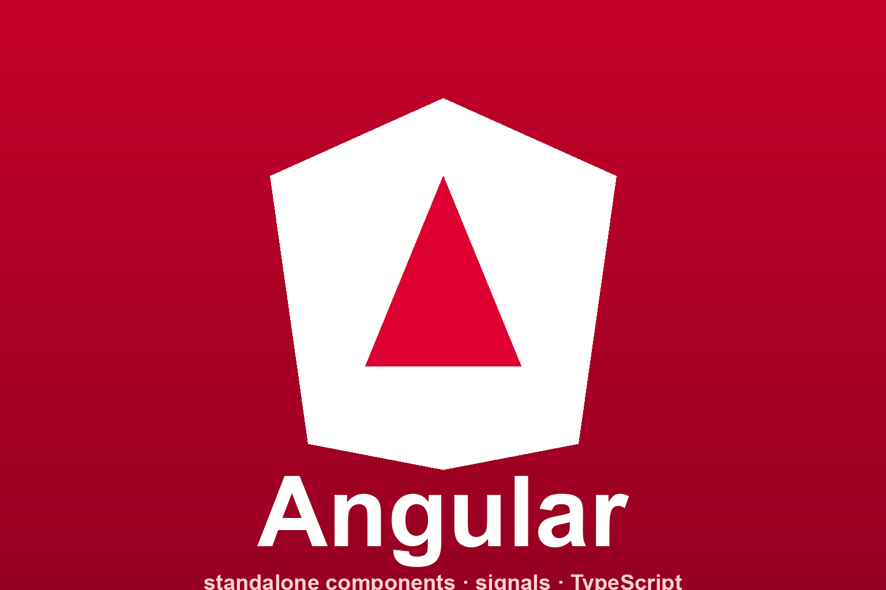

# Angular



Reference skill for [Angular](https://angular.dev/) — Google's TypeScript web
application framework. It steers an agent toward modern Angular (standalone
components, signals, new control flow, `inject()`) and away from the legacy
NgModule-based model, without relying on stale version recall.

## Install

```bash
npx skills add hardgraph/skills --skill angular
```

## Use this skill for

- Building standalone components with signals and computed state
- Templates, bindings, and the new `@if` / `@for` control flow
- Dependency injection with `inject()` and `providedIn: 'root'`
- Routing, forms, RxJS interop, and zoneless change detection
- Migrating off NgModules and legacy structural directives
- Resolving the current Angular version instead of guessing

## What is included

- [`SKILL.md`](./SKILL.md) — the agent procedure and integration guardrails.
- [`references/vendor/llms.txt/`](./references/vendor/llms.txt/) — a reproducible
  verbatim mirror of the Angular documentation the seed index links to, used for
  exact API and behaviour details.

## Source

Reference material is reproduced from the
[Angular documentation](https://angular.dev/) via its official
[llms.txt index](https://angular.dev/llms.txt).
