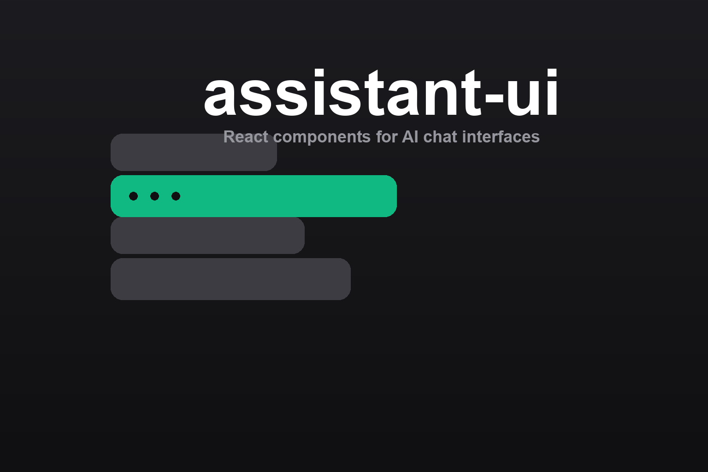

# assistant-ui



Reference skill for [assistant-ui](https://www.assistant-ui.com/) — the React
components and runtimes for building AI chat interfaces. It steers an agent
through the component/runtime architecture, the CLI, runtime adapters, and
part-based messages, without relying on stale version recall.

## Install

```bash
npx skills add hardgraph/skills --skill assistant-ui
```

## Use this skill for

- Building a chat thread, composer, and streaming UI in React
- Wiring components to a Vercel AI SDK or custom model runtime
- Rendering tool-call, image, and file message parts
- Scaffolding a project and adding components via the CLI
- Matching a shadcn, Radix UI, or Base UI design flavor
- Running on web, React Native, or the terminal

## What is included

- [`SKILL.md`](./SKILL.md) — the agent procedure and integration guardrails.
- [`references/vendor/llms.txt/`](./references/vendor/llms.txt/) — a reproducible
  verbatim mirror of the assistant-ui documentation the seed index links to,
  used for exact API and behaviour details.

## Source

Reference material is reproduced from the
[assistant-ui documentation](https://www.assistant-ui.com/) via its official
[llms.txt index](https://www.assistant-ui.com/llms.txt).
