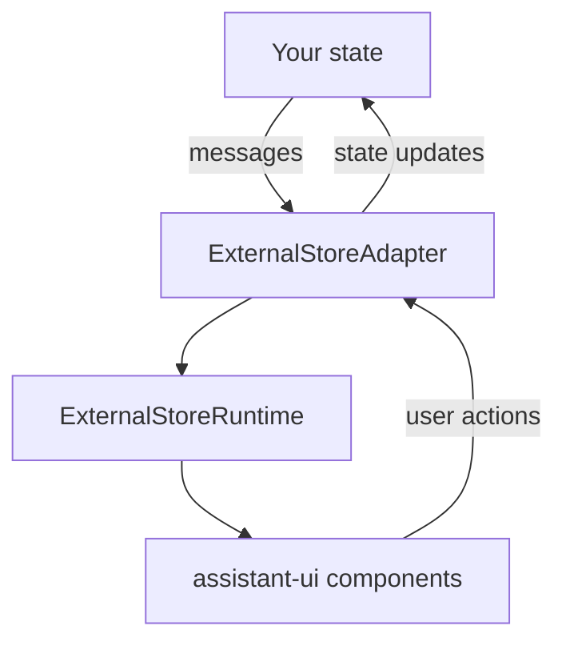

# ExternalStoreRuntime
URL: /docs/runtimes/custom/external-store

Bring your own redux, zustand, or state manager.

> For AI agents: a documentation index is available at [llms.txt](/llms.txt). Use `.md` for canonical markdown pages; `.mdx` is kept as a backwards-compatible alias on supported URL paths.

`ExternalStoreRuntime` bridges your existing state management with assistant-ui. You provide messages and callbacks; the runtime renders whatever you give it. UI features turn on based on which callbacks are present.

## When to use it

Pick `ExternalStoreRuntime` when:

- You already keep messages in redux, zustand, tanstack-query, or another store, and want to keep them there.
- You want full control over message state, persistence, and synchronization.
- You have a custom message format and need automatic conversion to assistant-ui's format.

If you do not have an existing store, use [`LocalRuntime`](/docs/runtimes/custom/local-runtime) instead; it is lower-friction.

## Architecture



Key idea: you own the state, the adapter translates between your format and assistant-ui's. UI features are capability-based; if you provide `setMessages`, branching turns on; if you provide `onEdit`, editing turns on; etc.

## Quickstart

1. ### Install

   ```bash
   npm install @assistant-ui/react
   ```

2. ### Create the runtime provider

   ```
   "use client";

   import { useState, ReactNode } from "react";
   import {
     useExternalStoreRuntime,
     ThreadMessageLike,
     AppendMessage,
     AssistantRuntimeProvider,
   } from "@assistant-ui/react";

   type MyMessage = { role: "user" | "assistant"; content: string };

   const convertMessage = (message: MyMessage): ThreadMessageLike => ({
     role: message.role,
     content: [{ type: "text", text: message.content }],
   });

   const backendApi = async (input: string): Promise<MyMessage> => {
     return { role: "assistant", content: "Hello, world!" };
   };

   export function MyRuntimeProvider({
     children,
   }: Readonly<{ children: ReactNode }>) {
     const [isRunning, setIsRunning] = useState(false);
     const [messages, setMessages] = useState<MyMessage[]>([]);

     const onNew = async (message: AppendMessage) => {
       if (message.content[0]?.type !== "text") {
         throw new Error("Only text messages are supported");
       }
       const input = message.content[0].text;
       setMessages((prev) => [...prev, { role: "user", content: input }]);

       setIsRunning(true);
       const assistant = await backendApi(input);
       setMessages((prev) => [...prev, assistant]);
       setIsRunning(false);
     };

     const runtime = useExternalStoreRuntime({
       isRunning,
       messages,
       convertMessage,
       onNew,
     });

     return (
       <AssistantRuntimeProvider runtime={runtime}>
         {children}
       </AssistantRuntimeProvider>
     );
   }
   ```

3. ### Use in your app

   ```
   import { Thread } from "@/components/assistant-ui/thread";
   import { MyRuntimeProvider } from "./MyRuntimeProvider";

   export default function Page() {
     return (
       <MyRuntimeProvider>
         <Thread />
       </MyRuntimeProvider>
     );
   }
   ```

## Message conversion

Two approaches.

### Inline `convertMessage`

```
const convertMessage = (message: MyMessage): ThreadMessageLike => ({
  role: message.role,
  content: [{ type: "text", text: message.text }],
  id: message.id,
  createdAt: new Date(message.timestamp),
});

const runtime = useExternalStoreRuntime({
  messages: myMessages,
  convertMessage,
  onNew,
});
```

### `useExternalMessageConverter` (with join strategy)

For performance optimization or when you need to merge adjacent assistant messages:

```
import { useExternalMessageConverter } from "@assistant-ui/react";

const convertedMessages = useExternalMessageConverter({
  callback: (message: MyMessage): ThreadMessageLike => ({
    role: message.role,
    content: [{ type: "text", text: message.text }],
    id: message.id,
  }),
  messages,
  isRunning: false,
  joinStrategy: "concat-content", // merges adjacent assistant messages
});

const runtime = useExternalStoreRuntime({
  messages: convertedMessages,
  onNew,
});
```

`joinStrategy` controls how adjacent assistant messages combine: `concat-content` (default) merges them into one; `none` keeps them separate.

## Handler matrix

Each handler enables a specific UI feature.

| Handler           | Enables                                                          |
| ----------------- | ---------------------------------------------------------------- |
| `onNew`           | Sending new user messages (required)                             |
| `setMessages`     | Branch switching                                                 |
| `onEdit`          | Message edit button                                              |
| `onReload`        | Regenerate button                                                |
| `onCancel`        | Cancel button while generating                                   |
| `onRefetchThread` | `threads.reloadMainThread()` refetching the open thread in place |
| `onAddToolResult` | Client-side tool result handoff                                  |
| `queue`           | Queueing messages sent while a run is in progress                |

## Streaming responses

Stream by mutating the assistant message in place:

```
const onNew = async (message: AppendMessage) => {
  const userMsg: ThreadMessageLike = {
    role: "user",
    content: message.content,
    id: generateId(),
  };
  setMessages((prev) => [...prev, userMsg]);

  setIsRunning(true);
  const assistantId = generateId();
  setMessages((prev) => [
    ...prev,
    { role: "assistant", content: [{ type: "text", text: "" }], id: assistantId },
  ]);

  const stream = await api.streamChat(message);
  for await (const chunk of stream) {
    setMessages((prev) =>
      prev.map((m) =>
        m.id === assistantId
          ? {
              ...m,
              content: [
                { type: "text", text: (m.content[0] as any).text + chunk },
              ],
            }
          : m,
      ),
    );
  }
  setIsRunning(false);
};
```

## Message editing

```
const onEdit = async (message: AppendMessage) => {
  const index = messages.findIndex((m) => m.id === message.parentId) + 1;
  const newMessages = [...messages.slice(0, index)];
  newMessages.push({
    role: "user",
    content: message.content,
    id: message.id ?? generateId(),
  });
  setMessages(newMessages);

  setIsRunning(true);
  const response = await api.chat(message);
  newMessages.push({ role: "assistant", content: response.content, id: generateId() });
  setMessages(newMessages);
  setIsRunning(false);
};
```

## Branching

The linear `messages` array assumes each message's parent is the previous one. For branching (e.g. multiple regenerations), use `ExportedMessageRepository.fromBranchableArray()` and import via `thread.import()`:

```
import {
  ExportedMessageRepository,
  useExternalStoreRuntime,
} from "@assistant-ui/react";

const backendMessages = [
  { id: "user-1", role: "user", content: "Hello", parentId: null },
  { id: "asst-1", role: "assistant", content: "Hi!", parentId: "user-1" },
  { id: "asst-2", role: "assistant", content: "Hey!", parentId: "user-1" }, // branch
];

const repo = ExportedMessageRepository.fromBranchableArray(
  backendMessages.map((m) => ({
    message: { id: m.id, role: m.role, content: m.content },
    parentId: m.parentId,
  })),
  { headId: "asst-1" },
);

runtime.thread.import(repo);
```

Each message must have an explicit `id` and `parentId`; messages with the same `parentId` create branches. Parents must appear before children in the array.

### Exporting a snapshot

`thread.import()` has a counterpart, `thread.export()`, which captures the current thread (including its full branch tree) as a serializable `ExportedMessageRepository`. Use it to persist a conversation and re-import it later:

```
// capture the current thread as a serializable snapshot
const repo = runtime.thread.export();
await saveToBackend(JSON.stringify(repo));

// later, restore it into a runtime
runtime.thread.import(repo);
```

The exported shape round-trips through `thread.import()` directly, so the same value is both your persistence format and what you load back.

### Persisting branch selection

If you store the full branch tree outside assistant-ui, persist the selected branch head too and pass it back as `messageRepository.headId`. `setMessages` still performs the branch switch; `unstable_onBranchChange` is an additional signal that fires after an explicit `switchToBranch` action, such as a BranchPicker click.

```
const runtime = useExternalStoreRuntime({
  messageRepository: {
    messages: storedMessages,
    headId: selectedHeadId,
  },
  setMessages: (messages) => {
    setVisibleMessages(messages);
  },
  unstable_onBranchChange: ({ headId, visibleMessageIds }) => {
    saveSelectedBranch({
      headId,
      visibleMessageIds,
    });
  },
  onNew,
});
```

`headId` is the canonical persisted head of the visible branch. Optimistic or transient message ids are not surfaced there. `visibleMessageIds` is the currently visible path in order, which can include an optimistic leaf while `headId` points to its persisted ancestor.

The callback only fires for explicit branch switches, and consecutive switches that resolve to the same canonical head are de-duped. It does not fire on adapter resync, `messageRepository` reset, append, edit/regenerate, content-only updates, or while the thread is running.

> [!warn]
>
> `unstable_onBranchChange` is under active development and may change without notice. It complements `setMessages`; it does not enable branch switching by itself.

## Tool calling

Handle tool results by updating the matching tool-call entry:

```
const onAddToolResult = (options: AddToolResultOptions) => {
  setMessages((prev) =>
    prev.map((message) =>
      message.id === options.messageId
        ? {
            ...message,
            content: message.content.map((part) =>
              part.type === "tool-call" &&
              part.toolCallId === options.toolCallId
                ? { ...part, result: options.result }
                : part,
            ),
          }
        : message,
    ),
  );
};

const runtime = useExternalStoreRuntime({
  messages,
  onNew,
  onAddToolResult,
});
```

The runtime automatically matches tool results to their tool calls by `toolCallId` and groups related messages for display.

## Attachments

Attachments use the standard adapter contract, see [adapters](/docs/runtimes/concepts/adapters#attachment-adapter):

```
const runtime = useExternalStoreRuntime({
  messages,
  onNew,
  adapters: { attachments: myAttachmentAdapter },
});
```

## Queueing messages during a run

By default, sending while the thread is running is disabled. Provide a `queue` adapter to buffer a message sent during a run and process it once the run settles. The pending message is exposed on `composer.queue` and renders through [`ComposerPrimitive.Queue`](/docs/api-reference/primitives/composer).

The `createMessageQueue` helper owns the two-lane ordering and the in-flight guard: `steerItems` drain before `items`, and within each lane items drain in order. Supply a driver that runs a message, pass its `adapter` to the runtime, and tell the queue when a run starts (`notifyBusy()`, so concurrent sends buffer) and ends (`notifyIdle()`).

A hand-rolled adapter must implement the same contract: `items` and `steerItems` expose the lanes (each item carries a required `parts` projection of its content), `enqueue`/`steer` add to a lane, and `move(queueItemId, placement)` repositions with fail-fast anchors — unknown ids or anchors throw rather than being coerced. Individual items are addressable through `composer.queueItem({ id })` (or by index).

```
import { useEffect, useRef, useState } from "react";
import { createMessageQueue, useExternalStoreRuntime } from "@assistant-ui/react";

const [queue] = useState(() => createMessageQueue({ run: onNew }));

const runtime = useExternalStoreRuntime({
  messages,
  isRunning,
  onNew,
  queue: queue.adapter,
});

const wasRunning = useRef(isRunning);
useEffect(() => {
  if (!wasRunning.current && isRunning) queue.notifyBusy();
  if (wasRunning.current && !isRunning) queue.notifyIdle();
  wasRunning.current = isRunning;
}, [isRunning, queue]);
```

Queue policy on cancel, edit, and reload is host-owned. Call `queue.notifyCancelled()` in your `onCancel` handler before aborting so the cancelled run's settle pauses draining instead of dispatching the next item (the next send or run start resumes it), or call `queue.clear()` to drop the pending items. Call `queue.clear()` in your `onEdit` and `onReload` handlers so stale items do not drain onto the new branch.

```
const runtime = useExternalStoreRuntime({
  // ...
  onCancel: async () => {
    queue.notifyCancelled(); // or queue.clear() to drop pending items
    await cancelRun();
  },
  onEdit: async (message) => {
    queue.clear();
    // ...
  },
  onReload: async (parentId) => {
    queue.clear();
    // ...
  },
});
```

## Multi-thread

`ExternalStoreRuntime` uses `ExternalStoreThreadListAdapter` (synchronous, inline). See [threads](/docs/runtimes/concepts/threads#externalstorethreadlistadapter) for the contract and best practices on keeping `currentThreadId` in sync with your store.

## Integration examples

### Redux

```
import { createSlice, PayloadAction } from "@reduxjs/toolkit";
import { ThreadMessageLike } from "@assistant-ui/react";

const chatSlice = createSlice({
  name: "chat",
  initialState: { messages: [] as ThreadMessageLike[], isRunning: false },
  reducers: {
    setMessages: (state, action: PayloadAction<ThreadMessageLike[]>) => {
      state.messages = action.payload;
    },
    addMessage: (state, action: PayloadAction<ThreadMessageLike>) => {
      state.messages.push(action.payload);
    },
    setIsRunning: (state, action: PayloadAction<boolean>) => {
      state.isRunning = action.payload;
    },
  },
});

export const { setMessages, addMessage, setIsRunning } = chatSlice.actions;
```

```
import { useSelector, useDispatch } from "react-redux";
import { useExternalStoreRuntime, AssistantRuntimeProvider } from "@assistant-ui/react";

export function ReduxRuntimeProvider({ children }) {
  const messages = useSelector((s: RootState) => s.chat.messages);
  const isRunning = useSelector((s: RootState) => s.chat.isRunning);
  const dispatch = useDispatch();

  const runtime = useExternalStoreRuntime({
    messages,
    isRunning,
    setMessages: (messages) => dispatch(setMessages(messages)),
    onNew: async (message) => {
      dispatch(
        addMessage({
          role: "user",
          content: message.content,
          id: `msg-${Date.now()}`,
          createdAt: new Date(),
        }),
      );
      dispatch(setIsRunning(true));
      const response = await api.chat(message);
      dispatch(
        addMessage({
          role: "assistant",
          content: response.content,
          id: `msg-${Date.now()}`,
          createdAt: new Date(),
        }),
      );
      dispatch(setIsRunning(false));
    },
  });

  return (
    <AssistantRuntimeProvider runtime={runtime}>
      {children}
    </AssistantRuntimeProvider>
  );
}
```

### Zustand

```
import { create } from "zustand";
import { immer } from "zustand/middleware/immer";
import { ThreadMessageLike } from "@assistant-ui/react";

interface ChatState {
  messages: ThreadMessageLike[];
  isRunning: boolean;
  addMessage: (message: ThreadMessageLike) => void;
  setMessages: (messages: ThreadMessageLike[]) => void;
  setIsRunning: (isRunning: boolean) => void;
}

export const useChatStore = create<ChatState>()(
  immer((set) => ({
    messages: [],
    isRunning: false,
    addMessage: (message) => set((s) => { s.messages.push(message); }),
    setMessages: (messages) => set((s) => { s.messages = messages; }),
    setIsRunning: (isRunning) => set((s) => { s.isRunning = isRunning; }),
  })),
);
```

```
import { useShallow } from "zustand/shallow";
import { useExternalStoreRuntime, AssistantRuntimeProvider } from "@assistant-ui/react";

export function ZustandRuntimeProvider({ children }) {
  const { messages, isRunning, addMessage, setMessages, setIsRunning } =
    useChatStore(
      useShallow((s) => ({
        messages: s.messages,
        isRunning: s.isRunning,
        addMessage: s.addMessage,
        setMessages: s.setMessages,
        setIsRunning: s.setIsRunning,
      })),
    );

  const runtime = useExternalStoreRuntime({
    messages,
    isRunning,
    setMessages,
    onNew: async (message) => {
      addMessage({
        role: "user",
        content: message.content,
        id: `msg-${Date.now()}`,
        createdAt: new Date(),
      });
      setIsRunning(true);
      const response = await api.chat(message);
      addMessage({
        role: "assistant",
        content: response.content,
        id: `msg-${Date.now()}-a`,
        createdAt: new Date(),
      });
      setIsRunning(false);
    },
  });

  return (
    <AssistantRuntimeProvider runtime={runtime}>
      {children}
    </AssistantRuntimeProvider>
  );
}
```

### TanStack Query

```
import { useQuery, useMutation, useQueryClient } from "@tanstack/react-query";
import { useExternalStoreRuntime } from "@assistant-ui/react";

const messageKeys = {
  all: ["messages"] as const,
  thread: (threadId: string) => [...messageKeys.all, threadId] as const,
};

export function TanStackQueryRuntimeProvider({ children }) {
  const queryClient = useQueryClient();
  const threadId = "main";

  const { data: messages = [] } = useQuery({
    queryKey: messageKeys.thread(threadId),
    queryFn: () => fetchMessages(threadId),
  });

  const sendMessage = useMutation({
    mutationFn: api.chat,
    onMutate: async (message: AppendMessage) => {
      await queryClient.cancelQueries({
        queryKey: messageKeys.thread(threadId),
      });
      const previous = queryClient.getQueryData<ThreadMessageLike[]>(
        messageKeys.thread(threadId),
      );
      queryClient.setQueryData<ThreadMessageLike[]>(
        messageKeys.thread(threadId),
        (old = []) => [
          ...old,
          {
            role: "user",
            content: message.content,
            id: `temp-${Date.now()}`,
            createdAt: new Date(),
          },
        ],
      );
      return { previous };
    },
    onError: (_err, _msg, context) => {
      if (context?.previous) {
        queryClient.setQueryData(messageKeys.thread(threadId), context.previous);
      }
    },
    onSettled: () =>
      queryClient.invalidateQueries({ queryKey: messageKeys.thread(threadId) }),
  });

  const runtime = useExternalStoreRuntime({
    messages,
    isRunning: sendMessage.isPending,
    onNew: async (message) => {
      await sendMessage.mutateAsync(message);
    },
    setMessages: (newMessages) => {
      queryClient.setQueryData(messageKeys.thread(threadId), newMessages);
    },
  });

  return (
    <AssistantRuntimeProvider runtime={runtime}>
      {children}
    </AssistantRuntimeProvider>
  );
}
```

## Working with external messages

### `getExternalStoreMessages`

Retrieve your original message format from any assistant-ui state:

```
import { getExternalStoreMessages, useAuiState } from "@assistant-ui/react";

function MyComponent() {
  const originalMessages = useAuiState((s) => getExternalStoreMessages(s.message));
  // originalMessages is MyMessage[] (your original type)
}
```

> [!warn]
>
> `getExternalStoreMessages` may return multiple messages for a single UI message; assistant-ui merges adjacent assistant and tool messages for display.

### `bindExternalStoreMessage`

Attach your original message to a `ThreadMessage` you constructed manually (outside the built-in converter):

```
import {
  bindExternalStoreMessage,
  getExternalStoreMessages,
} from "@assistant-ui/react";

bindExternalStoreMessage(threadMessage, originalMessage);
const original = getExternalStoreMessages(threadMessage);
```

`bindExternalStoreMessage` is a no-op if the target already has a bound message. It mutates the target in place.

> [!warn]
>
> This API is experimental and may change without notice.

## Best practices

1. **Immutable updates.** Always create new arrays:
   ```
   setMessages([...messages, newMessage]); // not messages.push(newMessage)
   ```
2. **Stable handler references.** Memoize `onNew`, `onEdit`, etc. with `useCallback` to avoid recreating the runtime.
3. **Use `useShallow`** with zustand to prevent unnecessary re-renders.

## Common pitfalls

**Edit / regenerate / cancel buttons missing.** Each requires its handler:

```
useExternalStoreRuntime({
  messages,
  onNew, // required
  setMessages, // branch switching
  onEdit, // edit
  onReload, // regenerate
  onCancel, // cancel
});
```

**State not updating.** check for: array mutation instead of new arrays, missing `setMessages`, broken async handling, or invalid `convertMessage` output.

**Messages going to the wrong thread.** the runtime's `currentThreadId` and your store's selected thread must stay in sync. Centralize thread id in a context, never in component-local state. See [threads](/docs/runtimes/concepts/threads#externalstorethreadlistadapter).

## API reference

### `ExternalStoreAdapter`

- `messages`: `readonly T[]` — Array of messages from your state.
- `onNew`: `(message: AppendMessage) => Promise<void>` — Handler for new messages from the user.
- `isRunning`: `boolean` (default `false`) — Whether the assistant is currently generating a response. When true, shows an optimistic assistant message and flows directly to thread.isRunning.
- `isDisabled`: `boolean` (default `false`) — Disables the entire composer, including the text input. For a narrower gate that keeps the input usable but blocks only sending, use isSendDisabled.
- `isSendDisabled`: `boolean` (default `false`) — Blocks new-message sending while leaving the input usable. When true, the thread composer's canSend becomes false, the Send button is disabled, Enter and the steer hotkey are no-ops, and aui.composer.send() short-circuits. Edit composers (saving message edits) ignore this flag. Use this to gate sending on external React state (e.g. while tools or auth are still loading).
- `isLoading?`: `boolean` — Whether the adapter is in a loading state. Displays a loading indicator instead of the composer.
- `suggestions?`: `readonly ThreadSuggestion[]` — Suggested prompts to display.
- `extras?`: `unknown` — Additional data accessible via runtime.extras.
- `setMessages?`: `(messages: readonly T[]) => void` — Update messages (required for branch switching).
- `unstable_onBranchChange?`: `(event: ExternalStoreBranchChange) => void` — Called after an explicit branch switch with the canonical persisted head id and visible message path. Complements setMessages and is unstable.
- `onEdit?`: `(message: AppendMessage) => Promise<void>` — Handler for message edits (required for edit feature).
- `onReload?`: `(parentId: string | Null, config: StartRunConfig) => Promise<void>` — Handler for regenerating messages (required for reload feature).
- `onCancel?`: `() => Promise<void>` — Handler for cancelling the current generation.
- `onRefetchThread?`: `() => Promise<void>` — Handler for re-fetching this thread's state in place, driving threads.reloadMainThread(). Unrelated to onReload, which re-generates an assistant message.
- `onAddToolResult?`: `(options: AddToolResultOptions) => Promise<void> | Void` — Handler for adding tool call results.
- `onResume?`: `(config: ResumeRunConfig) => Promise<void>` — Handler for resuming an interrupted run (e.g. after a page reload mid-generation). For AI SDK reload-safe streaming, see the [Resumable Streams](/docs/guides/resumable-streams) guide.
- `onResumeToolCall?`: `(options: { toolCallId: string; payload: unknown }) => void` — Handler for resuming a suspended tool call (used with human-in-the-loop tool execution).
- `messageRepository?`: `ExportedMessageRepository` — Pre-built message repository with branching history. Use instead of messages when you need to restore branch state.
- `state?`: `ReadonlyJSONValue` — Opaque serializable state passed to onLoadExternalState during thread import.
- `onImport?`: `(messages: readonly ThreadMessage[]) => void` — Called when the runtime imports messages into the external store (e.g. on thread switch).
- `onExportExternalState?`: `() => any` — Called to retrieve external state when the runtime exports a thread snapshot.
- `onLoadExternalState?`: `(state: any) => void` — Called with previously exported external state when restoring a thread snapshot.
- `convertMessage?`: `(message: T, index: number) => ThreadMessageLike` — Convert your message format to assistant-ui format. Not needed if using ThreadMessage type.
- `adapters?`: `object` — Capability adapters: attachments, speech, dictation, feedback, threadList. See /docs/runtimes/concepts/adapters.
- `unstable_capabilities?`: `object` — Configure runtime capabilities (e.g. copy). Unstable, may change.

### `ThreadMessageLike`

- `role`: `"assistant" | "user" | "system"` — The role of the message sender.
- `content`: `string | Readonly MessagePart[]` — Message content as string or structured message parts. Supports data-\* prefixed types (e.g. { type: "data-workflow", data: {...} }) which are automatically converted to DataMessagePart.
- `id?`: `string` — Unique identifier for the message.
- `createdAt?`: `Date` — Timestamp when the message was created.
- `status?`: `MessageStatus` — Status of assistant messages ({ type: "running" }, { type: "complete" }, { type: "incomplete" }).
- `attachments?`: `readonly CompleteAttachment[]` — File attachments (user messages only). Type accepts custom strings beyond "image" | "document" | "file"; contentType is optional.
- `metadata?`: `object` — Additional message metadata (steps, custom fields).

## Related

- [LocalRuntime](/docs/runtimes/custom/local-runtime) — Simpler core runtime when you do not have your own state store.
- [Adapters](/docs/runtimes/concepts/adapters) — Attachments, speech, feedback, history, suggestions.
- [Threads](/docs/runtimes/concepts/threads) — ExternalStoreThreadListAdapter for multi-thread.