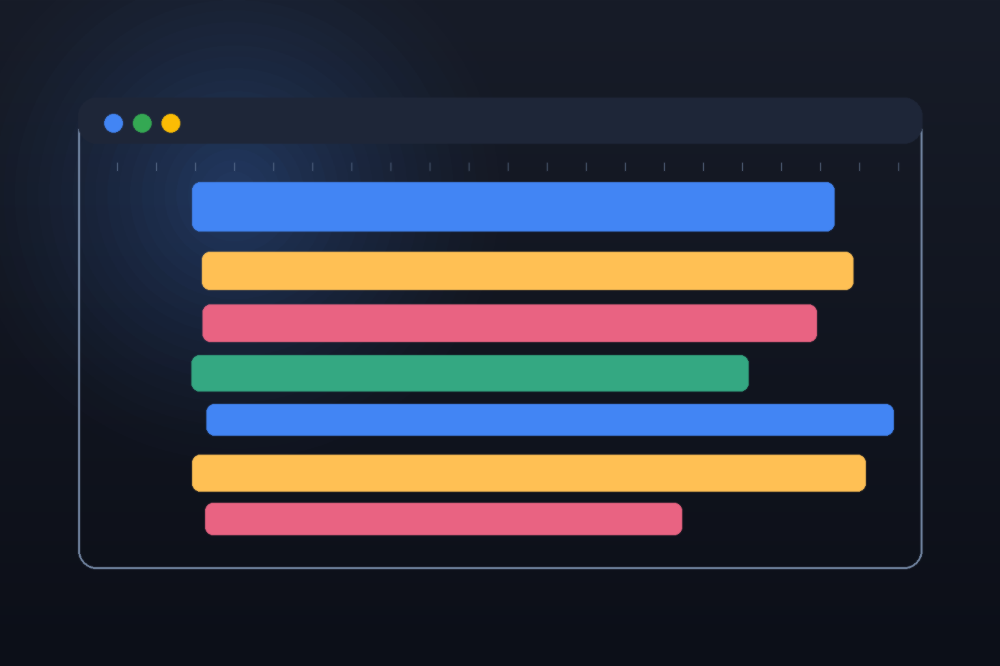

# chrome-devtools



Reference skill for [Chrome DevTools](https://developer.chrome.com/docs/devtools)
— the inspector, debugger, profiler, and automation toolset built into Chrome
and Edge. It steers an agent through the panel model, JavaScript debugging with
breakpoints and source maps, performance and memory profiling, storage and
service-worker inspection, and the Chrome DevTools Protocol, without relying on
stale version recall.

## Install

```bash
npx skills add hardgraph/skills --skill chrome-devtools
```

## Use this skill for

- Debugging a web page: DOM/styles, network, console, and breakpoints
- Profiling a slow interaction or page load and reading the flame chart
- Tracking down a memory leak with heap snapshots
- Inspecting storage, cookies, and service workers
- Recording and replaying user flows with the Recorder
- Driving DevTools remotely over the Chrome DevTools Protocol (CDP)

## What is included

- [`SKILL.md`](./SKILL.md) — the agent procedure and profiling guardrails.
- [`references/vendor/llms.txt/`](./references/vendor/llms.txt/) — a reproducible
  verbatim mirror of the Chrome DevTools documentation the seed index links to,
  used for exact panel, shortcut, and API details.

## Source

Reference material is reproduced from the
[Chrome DevTools documentation](https://developer.chrome.com/docs/devtools) via
its official [llms.txt index](https://developer.chrome.com/docs/devtools/llms.txt).
