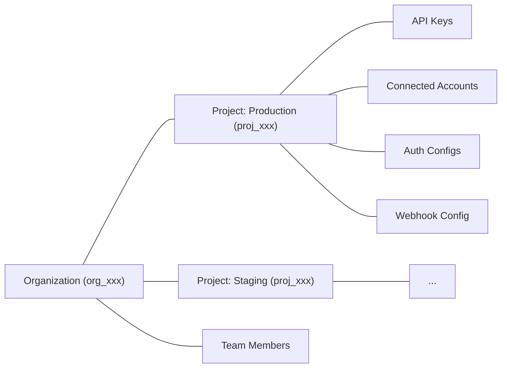

# Projects (/reference/v3/api-reference/projects)

> **API version:** This page documents Composio REST API v3.0 at `https://backend.composio.dev/api/v3`, the previous version. v3.1 is current, at `https://backend.composio.dev/api/v3.1` — the same page on v3.1 is /reference/api-reference/projects.md.

{/* Auto-generated from OpenAPI spec. Edit the overview at api-overviews/projects.mdx, not this file. */}

Projects are Composio's multi-tenancy primitive. Every Composio account belongs to an **organization**. Inside an organization, **projects** are isolated environments that scope your API keys, connected accounts, auth configs, and webhook configurations. Resources in one project are not accessible from another.



Common reasons to use multiple projects:

* **Separate environments**: keep production and staging isolated
* **Separate products**: keep resources for different apps independent
* **Client isolation**: give each client their own project with separate credentials and data

# Managing projects [#managing-projects]

Manage projects from the [dashboard](https://dashboard.composio.dev/~/org/) or via the API using an **organization API key** (`x-org-api-key`).

> Project management endpoints use the `x-org-api-key` header, not the regular `x-api-key`. Find your org API key in the dashboard under **Settings > Organization**.

There is no limit on the number of projects per organization. Project names must be unique within the organization. Create a project with `should_create_api_key: true` to get an API key back in the response:

```bash
curl -X POST https://backend.composio.dev/api/v3.1/org/owner/project/new \
  -H "x-org-api-key: YOUR_ORG_API_KEY" \
  -H "Content-Type: application/json" \
  -d '{
    "name": "my-staging-project",
    "should_create_api_key": true
  }'
```

```json
{
  "id": "proj_abc123xyz456",
  "name": "my-staging-project",
  "api_key": "ak_abc123xyz456"
}
```

The list endpoint supports pagination with `limit` and `cursor`; getting a project by ID returns the full project object including its API keys.

# Project settings [#project-settings]

Each project has settings that control security, logging, and display behavior. The project detail endpoints return current configuration for inspection. Use **Settings > Project Settings** in the [dashboard](https://dashboard.composio.dev/~/project/settings/general) to update project settings.

Notable security setting: `require_mcp_api_key`, when `true`, requires MCP server requests to include a valid `x-api-key` header. This defaults to `true` for organizations created on or after March 5, 2026.

# Endpoints [#endpoints]

| Method | Path | Endpoint |
| --- | --- | --- |
| `GET` | `/api/v3/org/project/list` | [List all projects](/reference/v3/api-reference/projects/getOrgProjectList) |
| `POST` | `/api/v3/org/owner/project/new` | [Create a new project](/reference/v3/api-reference/projects/postOrgOwnerProjectNew) |
| `GET` | `/api/v3/org/owner/project/list` | [List all projects](/reference/v3/api-reference/projects/getOrgOwnerProjectList) |
| `GET` | `/api/v3/org/owner/project/{nano_id}` | [Get project details by ID With Org Api key](/reference/v3/api-reference/projects/getOrgOwnerProjectByNanoId) |
| `DELETE` | `/api/v3/org/owner/project/{nano_id}` | [Delete a project](/reference/v3/api-reference/projects/deleteOrgOwnerProjectByNanoId) |
| `POST` | `/api/v3/org/owner/project/{nano_id}/regenerate_api_key` | [Delete and generate new API key for project](/reference/v3/api-reference/projects/postOrgOwnerProjectByNanoIdRegenerateApiKey) |

---

📚 **More documentation:** [View all docs](https://docs.composio.dev/llms.txt) | [Glossary](https://docs.composio.dev/llms.mdx/reference/glossary) | [Examples](https://docs.composio.dev/llms.mdx/examples) | [API Reference](https://docs.composio.dev/llms.mdx/reference)

---

# Composio SDK — Notes for AI Code Generators

**Purpose:** Reference for generating current (v3) [Composio](https://composio.dev/) integration code.
**Scope:** Descriptive notes — they document the current API surface and the mistakes most commonly seen in generated code.

---

## 1. Recommended Integration: Sessions

Composio supports two integration modes: **Native Tools** (with a provider package) and **MCP** (no provider package needed).

### Native Tools

```python
# ✅ CORRECT — Python (defaults to OpenAI)
from composio import Composio

composio = Composio()
session = composio.create(user_id="user_123")
tools = session.tools()
# Pass tools to your agent/LLM framework
```

```typescript
// ✅ CORRECT — TypeScript (defaults to OpenAI)
import { Composio } from "@composio/core";

const composio = new Composio();
const session = await composio.create("user_123");
const tools = await session.tools();
// Pass tools to your agent/LLM framework
```

For other providers, pass the provider explicitly. Provider packages follow the naming convention: `composio_<provider>` for Python, `@composio/<provider>` for TypeScript.

### MCP

Use `session.mcp.url` and `session.mcp.headers` with any MCP-compatible client (Claude Desktop, Cursor, OpenAI Agents, etc.). No provider package needed.

---

## 2. Integration Notes

- `composio.create(user_id)` is the standard entry point for agent integrations. Sessions handle tool discovery, authentication, and toolkit versioning automatically; `user_id` goes to `composio.create()` — individual tool calls in session mode don't take one.
- Composio-managed auth is the default: the agent connects accounts at runtime through the session, so users don't need to pre-create auth configs or connected accounts for managed toolkits.
- Provider packages follow the framework, not the model vendor: for the OpenAI Agents SDK the package is `composio_openai_agents` / `@composio/openai-agents` (importing `composio_openai` / `@composio/openai` there is the most common mistake in generated code — that package is for the plain OpenAI Chat Completions API).
- **Direct execution** (`composio.tools.get()`, `composio.tools.execute()`, `provider.handle_tool_calls()`) is a fully supported lower-level interface: your code picks the tool, no runtime discovery. It fits deterministic workflows and scripts; sessions fit agents that decide at runtime. The tradeoffs are documented at https://docs.composio.dev/docs/sessions-vs-direct-execution. Note that direct execution requires a toolkit version (https://docs.composio.dev/docs/tools-direct/toolkit-versioning).

---

# 3. Calling the REST API directly

## REST API version

The current REST API version is **v3.1**, served at `https://backend.composio.dev/api/v3.1`. Prefer it for new code and new examples.

`https://backend.composio.dev/api/v3` is the previous version. It is frozen with pinned tool-version defaults and remains supported — existing v3 integrations keep working and do not need to migrate.

## Tool-endpoint version defaults on v3.1

On v3.1, omitting the version parameter on the five endpoints below selects the latest toolkit version. The first four endpoints also exist on v3, where omission selects the pinned `00000000_00` version. `POST /tools/scopes/required` is v3.1-only.

| Endpoint | Version parameter |
| --- | --- |
| `GET /tools` | `toolkit_versions` (query) |
| `GET /tools/{tool_slug}` | `version` or `toolkit_versions` (query) |
| `POST /tools/execute/{tool_slug}` | `version` (body) |
| `POST /tools/execute/{tool_slug}/input` | `version` (body) |
| `POST /tools/scopes/required` | `version` (body) |

A v3.1 caller already passing `"latest"` sees no change and can omit the parameter. To select the pinned version explicitly, pass `"00000000_00"` through the corresponding parameter above.

This version-default change is limited to the five endpoints above.


---

## Terminology Migration (old → current)

If you encounter these terms in error messages, old documentation, or user prompts, translate them to the current equivalents. **Do not use the old terms in generated code or explanations.**

| Old term (v1/v2) | Current term (v3) | In code |
|---|---|---|
| entity ID | user ID | `user_id` parameter |
| actions | tools | e.g., `GITHUB_CREATE_ISSUE` is a *tool* |
| apps / appType | toolkits | e.g., `github` is a *toolkit* |
| integration / integration ID | auth config / auth config ID | `auth_config_id` parameter |
| connection | connected account | `connected_accounts` namespace |
| ComposioToolSet / OpenAIToolSet | `Composio` class with a provider | `Composio(provider=...)` |
| toolset | provider | e.g., `OpenAIProvider` |

If a user says "entity ID", they mean `user_id`. If they say "integration", they mean "auth config". Always respond using the current terminology.

