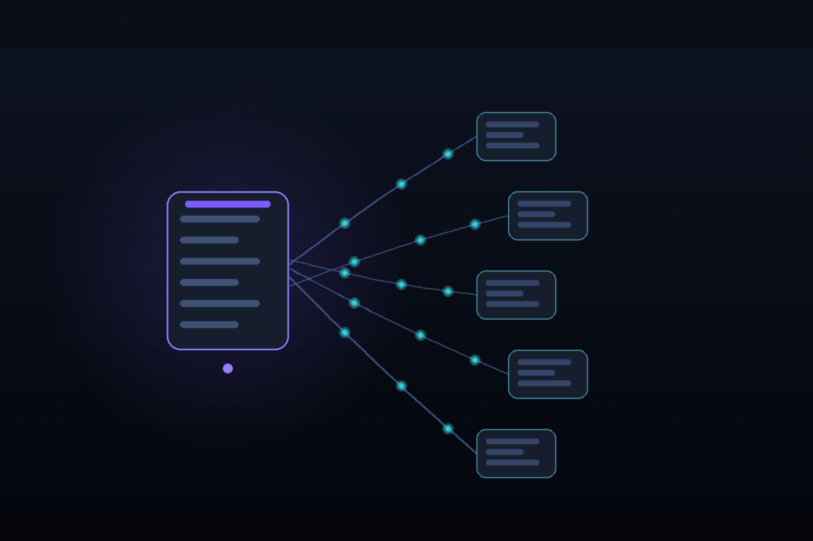

# Convex



Practical guidance for building on Convex, the reactive backend where you write TypeScript
functions and a schema and Convex runs your code, stores data, and pushes realtime updates to
clients — without a hand-written HTTP or ORM layer.

## Install

```bash
npx skills add hardgraph/skills --skill convex
```

## Use this skill for

- Choosing between query, mutation, action, and internal function kinds
- Designing a reactive document data model with indexes instead of relational joins
- Wiring auth (OIDC), file storage, vector/text search, and HTTP webhook routes
- Using scheduled functions and cron for background work
- Avoiding the failure modes of the serverless-reactive model (actions aren't transactional;
  unindexed queries; subscription cost)

## What is included

- [`SKILL.md`](./SKILL.md) contains the agent procedure and the function-type decision model.
- [`references/vendor/llms.txt/`](./references/vendor/llms.txt/) contains the mirrored Convex
  documentation used for exact API, schema, and CLI details.
