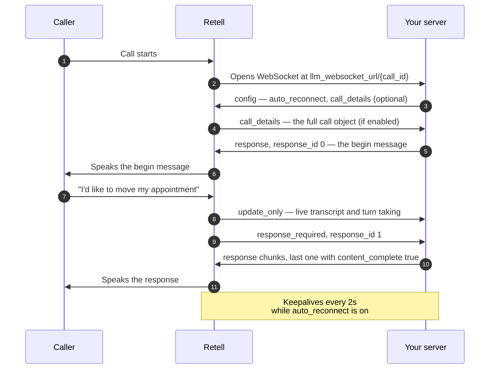

> ## Documentation Index
> Fetch the complete documentation index at: https://docs.retellai.com/llms.txt
> Use this file to discover all available pages before exploring further.

# Custom LLM overview

> Run your own LLM behind a Retell voice agent. Retell handles telephony, transcription, and turn-taking while your WebSocket server generates each reply.

With a custom LLM, you own response generation. Retell handles the call itself (telephony, transcription, turn-taking, speech synthesis) and opens a WebSocket to your server for each call. Retell sends you the live transcript and asks for responses; you stream back what the agent should say.

<Note>
  We recommend [single prompt](/build/prompt) or [conversation flow](/build/conversation-flow/overview) for most agents. They get the newest features, and they come already tuned for things like latency.
</Note>

## When to use it

[Single prompt](/build/prompt) and [conversation flow](/build/conversation-flow/overview) agents give you built-in tool calling, a [knowledge base](/build/knowledge-base), warm transfers, and a testing playground with no server to run. They're the right choice for most agents.

Reach for a custom LLM when you need something those frameworks can't give you:

* **Compliance constraints.** Prompts and transcripts must be processed inside your own infrastructure, or by a model you host.
* **A model Retell doesn't offer.** A fine-tuned model, a self-hosted open-weights model, or a provider outside the supported options.
* **Response logic beyond what Retell's frameworks support.** Your own retrieval pipeline instead of Retell's [knowledge base](/build/knowledge-base), a multi-step agent loop that runs before the agent speaks, or orchestration that already lives in your own code.

You take on latency, uptime, and reconnection handling. You also give up the features that assume Retell generates the responses:

* The [LLM playground](/test/llm-playground) can't test a custom LLM agent, and [simulation and batch testing](/test/test-overview) reject them. Web and phone calls are the only way to test.
* [Agent transfer](/build/single-multi-prompt/transfer-agent) can't target a custom LLM agent.
* Your own tool calls only appear in the transcript if you [report them yourself](/integrate-llm/integrate-function-calling#record-tool-calls-in-the-transcript). Retell records the actions it runs (`end_call`, `transfer_call`, `press_digit`) automatically.

## How a call flows

One WebSocket is opened per call, to `llm_websocket_url` with the call ID appended as the last path segment. Retell drives the conversation and tells you when it needs something.

Retell decides when the agent speaks, so not every response you generate gets used. If the caller keeps talking, Retell discards the response it asked for and asks again with a new `response_id`.

## What your server implements

Retell tags every message it sends with `interaction_type`:

| `interaction_type`  | You must                | What it carries                                                                                                                      |
| ------------------- | ----------------------- | ------------------------------------------------------------------------------------------------------------------------------------ |
| `response_required` | Reply with a `response` | The live transcript and a `response_id`. Retell is waiting to speak.                                                                 |
| `reminder_required` | Reply with a `response` | Same shape, but the caller has gone quiet and Retell wants a nudge.                                                                  |
| `update_only`       | Nothing                 | Transcript updates and `turntaking` changes. Read it or ignore it.                                                                   |
| `call_details`      | Nothing                 | The full call object, including [dynamic variables](/build/dynamic-variables) and metadata. Only sent if you ask for it in `config`. |
| `ping_pong`         | Echo it back            | A keepalive timestamp. Only sent if you set `auto_reconnect`.                                                                        |

You tag everything you send with `response_type`:

| `response_type`                             | Required                  | What it does                                                                                                  |
| ------------------------------------------- | ------------------------- | ------------------------------------------------------------------------------------------------------------- |
| `response`                                  | Yes                       | Streams content for the agent to speak. Can also end the call, transfer, or press digits.                     |
| `config`                                    | No                        | Sent once on connect to turn on keepalives, call details, and tool-call transcripts.                          |
| `ping_pong`                                 | If `auto_reconnect` is on | Echoes the keepalive so Retell knows you're alive.                                                            |
| `agent_interrupt`                           | No                        | Makes the agent speak immediately, cutting off whoever is talking. Also cancels any response still in flight. |
| `tool_call_invocation` / `tool_call_result` | No                        | Records your tool calls in the call transcript.                                                               |
| `update_agent`                              | No                        | Changes responsiveness, interruption sensitivity, or reminder timing mid-call.                                |
| `metadata`                                  | No                        | Forwards arbitrary data to a web call frontend.                                                               |

<Warning>
  Always set `response_type` on messages you send. Retell treats a message with no `response_type` as a `response` for backward compatibility, but that fallback is the reason a malformed event fails silently instead of erroring.
</Warning>

The [LLM WebSocket reference](/api-references/llm-websocket) has the full field-by-field spec for every event above.

## Example servers

Runnable reference implementations, both with function calling:

* [Node.js (Express)](https://github.com/RetellAI/retell-custom-llm-node-demo) — OpenAI, Azure OpenAI, OpenRouter
* [Python (FastAPI)](https://github.com/RetellAI/retell-custom-llm-python-demo) — OpenAI, Claude

<Note>
  These repos might be outdated already. Follow the guides in this section wherever the two differ.
</Note>

## Next steps

<CardGroup cols={2}>
  <Card title="Set up your WebSocket server" icon="plug" href="/integrate-llm/setup-websocket-server">
    Get an agent talking with a hardcoded response, before adding an LLM.
  </Card>

  <Card title="Connect your LLM" icon="brain" href="/integrate-llm/integrate-llm">
    Stream real completions back, and handle discarded responses correctly.
  </Card>

  <Card title="Add function calling" icon="wrench" href="/integrate-llm/integrate-function-calling">
    Let the agent book, transfer, press digits, and end the call.
  </Card>

  <Card title="Best practices" icon="gauge" href="/integrate-llm/llm-best-practice">
    Keep time-to-first-sentence low enough to sound natural.
  </Card>
</CardGroup>
