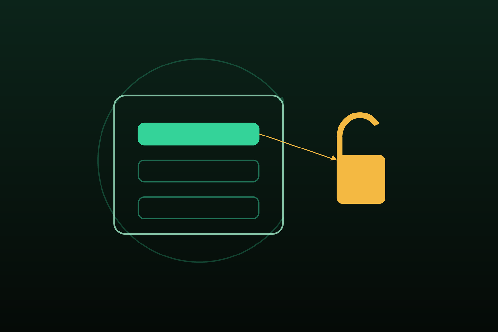

# revenuecat



Reference skill for [RevenueCat](https://www.revenuecat.com/) — the cross-platform subscription and
in-app-purchase platform wrapping the App Store, Google Play, Amazon, and Stripe behind one SDK and
one server API. It steers an agent through products, offerings, and entitlements; the Purchases SDK on
iOS/Android/web/Flutter/React Native/Unity; anonymous vs identified user identity; server webhooks
for authoritative access; restore; StoreKit 2 and Play Billing; and sandbox testing — without relying
on stale version recall.

## Install

```bash
npx skills add hardgraph/skills --skill revenuecat
```

## Use this skill for

- Implementing paid subscriptions or one-time purchases across iOS, Android, and web
- Configuring RevenueCat products, offerings, and entitlements
- Checking entitlement status via `CustomerInfo` to gate features
- Receiving server-side subscription webhooks to grant access from a backend
- Restoring purchases and handling renewal, refund, and billing-retry lifecycle events
- Managing anonymous vs identified app user IDs without losing purchases
- Testing purchases with StoreKit Configuration files and Play license-test accounts

## What is included

- [`SKILL.md`](./SKILL.md) — the RevenueCat mental model, the entitlement-source-of-truth rule, and
  the webhook pitfalls.
- [`references/vendor/llms.txt/`](./references/vendor/llms.txt/) — a reproducible verbatim mirror of
  the RevenueCat documentation via its official
  [llms.txt index](https://docs.revenuecat.com/llms.txt).

## Source

Reference material is reproduced from the
[RevenueCat documentation](https://www.revenuecat.com) via its official
[llms.txt index](https://docs.revenuecat.com/llms.txt).
